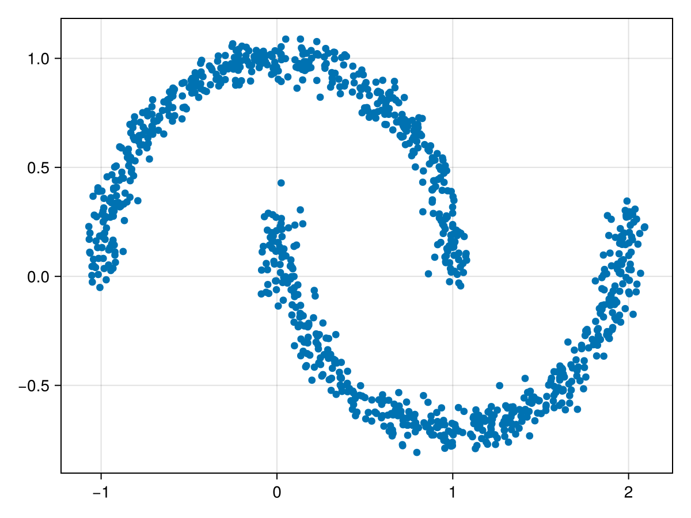
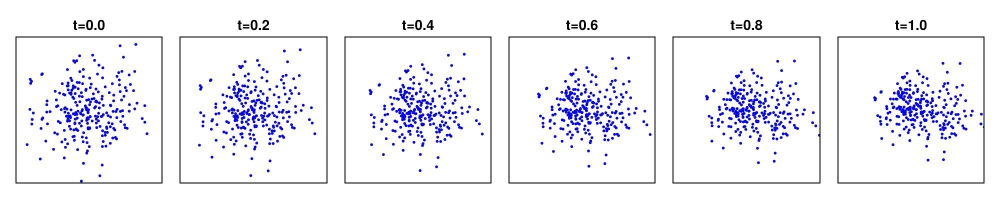

+++
date = "2025-05-07"
title = "Flow Matching Guide and Code in Julia"
var"layout-post" = nothing
tags = ["julia"]
rss = "Flow Matching Guide and Code in Julia"

# # Dependent variables
# website_description = replace(rss, "*" => "")
# rss_pubdate = 2025-05-07
+++


# Flow Matching Guide and Code in Julia 

## Quick tour and key concepts

**Goal.**
Given a training dataset of samples from some target distribution $q$ over $\mathbb{R}^d$, out goal is to build a model capable of generating new samples from $q$.

**Approach.**
Flow Matching addresses this by building a probability path $(p_t)_{0 \leq t \leq 1}$ from a known source distribution $p_0 = p$ to the data target distribution $p_1 = q$, by learning a "velocity field" that describes the instantaneous velocities of samples. Later, this is used to convert the source distribution $p_0$ into the target distribution $p_1$ along the probability path $p_t$. Once trained, we generate samples by sampling from $p$ and then propagating the sample along the velocity field by solving the corresponding ODE. 

**About the ODE.**
Consider a simple Ordinary Differential Equation (ODE) initial value problem of the form
$$\dot{\xi}(t) = u(t, \xi(t)), \qquad \xi(0) = x.$$
This defines a time-dependent *flow* $\psi: [0, 1] \times \mathbb{R}^d \to \mathbb{R}^d$, which is a mapping from the initial value to the ODE solution at time t. That is, it satisfies
$$\frac{\mathrm{d}}{\mathrm{d}t} \psi(t, x) = u(t, \psi(t, x)), \qquad \psi(0, x) = x.$$
The velocity field also generates the probability path $p_t$: If $X_0 \sim p_0$, then $X_t := \psi(t, X_0) \sim p_t$.
In the following, we shorten the notation to $\psi_t(x) := \psi(t, x)$ and $u(t, x) := u_t(x)$.

With this in place, the goal of Flow Matching is to learn the parameters $\theta$ of a velocity field $u_t^\theta$, parameterized via a neural network.
We will do this in two steps:
1. Design a probability path $p_t$ interpolating between $p$ and $q$,
2. Train a velocity field $u_t^\theta$ generating $p_t$ by means of regression.

**Step 1: Designing the probability path $p_t$.**
In this example we choose a source distribution $p = p_0 = \mathcal{N}(x; 0, I)$,
and we construct the probability path as 
$$p_t(x) = \int p_{t|1}(x|x_1) q(x_1) \mathrm{d}x_1,$$
where $p_{t|1} = \mathcal{N}(x; tx_1, (1-t)^2 I).$
This is also known as the*conditional optimal-transport* or *linear* path.

Using this path, we may define the random variable $X_t \sim p_t$ by drawing $X_0 \sim p$, $X_1 \sim q$, and taking their linear combination:
$$X_t = t X_1 + (1-t) X_0 \sim p_t.$$

**Step 2: Train the velocity field $u_t^\theta$.**
We now want to regress our velocity field $u_t^\theta$, usually a neural network, to a target velocity field $u_t$ known to generate the desired probability path $p_t$.

The *Flow Matching loss* that describes this regression problem in general reads as follows:
$$\mathcal{L}_\text{FM}(\theta) = \mathbb{E}_{t, X_t} \| u_t^\theta(X_t) - u_t(X_t) \|^2, \qquad \text{where } t \sim \mathcal{U}[0,1] \text{ and } X_t \sim p_t.$$
But in practice, this can rarely be implemented as $u_t$ is too complicated.
We can however simply the objective by conditioning the loss on a single target example $x_1$, picked at random from the training set.
This defines the conditional probability path $p_{t|1}(x|x_1) = \mathcal{N}(x; t x_1, (1-t)^2 I)$, which has the corresponding *conditional velocity field* (**??**)
$$u_t(x|x_1) = \frac{x_1 - x}{1 - t}.$$

We can now define the *conditional Flow Matching loss*:
$$\mathcal{L}_\text{CFM}(\theta) = \mathbb{E}_{t, X_t, X_1} \| u_t^\theta(X_t) - u_t(X_t|X_1) \|^2, \qquad \text{where } t \sim \mathcal{U}[0,1],\ X_0 \sim p,\ X_1 \sim q,\ X_t=(1-t) X_0 +t X_1.$$
Remarkably, both objectives provide the same gradients to learn $u_t^\theta$, i.e. $\nabla_\theta \mathcal{L}_\text{FM}(\theta) = \nabla_\theta \mathcal{L}_\text{CFM}(\theta)$.

To conclude, we plt the vector field $u_t(x|x_1)$ into the loss and obtain the simplest implementation of Flow Matching:
$$\mathcal{L}_\text{CFM}^\text{OT,Gauss}(\theta) = \mathbb{E}_{t, X_0, x_1} \| u_t^\theta(X_t) - (X_1 - X_0) \|^2, \qquad \text{where } t \sim \mathcal{U}[0,1],\ X_0 \sim p,\ X_1 \sim q.$$

## Simple Flot Matching in Code

We will now implement the above algorithm in a simple example on the well-known two-moons data:

```julia
using MLJBase, CairoMakie

X, _ = make_moons(1024; noise=0.05)
X = collect.(MLJBase.Tables.rows(X))

scatter(
    [x[1] for x in X], [x[2] for x in X], 
)
```




We approach the implementation in the following steps.
1. First, we implement the **velocity field** by building a neural network in [Lux.jl](https://lux.csail.mit.edu/stable/). We will follow the architecture provided in the corresponding example in the paper.
2. Then, we implement the **training objective**, i.e. the loss function we discussed above. 
3. We then **learn the neural network parameters** by minimizing this loss function with [Optimization.jl](https://docs.sciml.ai/Optimization/stable/). We obtain the model parameters of a velocity field which should be close to the target velocity field.
4. We evaluate the resulting model by **drawing samples $X_0 \sim p$ and propagating them forward through the velocity field** to check if the resulting samples match the target distribution $q$. We do this by solving the corresponding ODE wiht [OrdinaryDiffEq.jl](https://github.com/SciML/OrdinaryDiffEq.jl).

Other packages that we'll rely on include [ComponentArrays.jl](https://docs.sciml.ai/ComponentArrays/stable/) for convenient parameter handling, [Plots.jl](https://docs.juliaplots.org/latest/tutorial/) for plotting, [SimpleUnPack.jl](https://github.com/devmotion/SimpleUnPack.jl) for conveniently unstructuring named tuples,

```julia
# General packages
using Random, SimpleUnPack
import ComponentArrays
```


**1. Define the neural network velocity field.**

```julia
using Lux, NNlib

hidden = 64
model = Chain(
    ((x, t),) -> vcat(x, t),
    Dense(2 + 1, hidden, NNlib.elu),
    Dense(hidden, hidden, NNlib.elu),
    Dense(hidden, hidden, NNlib.elu),
    Dense(hidden, 2),
)
model = f64(model)

rng = Random.default_rng()
ps, st = Lux.setup(rng, model)
ps = Float64.(ComponentArrays.ComponentArray(ps))

model
```

```
Chain(
    layer_1 = WrappedFunction(#5),
    layer_2 = Dense(3 => 64, elu),      # 256 parameters
    layer_3 = Dense(64 => 64, elu),     # 4_160 parameters
    layer_4 = Dense(64 => 64, elu),     # 4_160 parameters
    layer_5 = Dense(64 => 2),           # 130 parameters
)         # Total: 8_706 parameters,
          #        plus 0 states.
```


**2. Define the loss function as derived above.**

```julia
BATCH_SIZE = 256

function loss_fn(ps, other_params)
    st = other_params.st
    # sample x1 randomly from the dataset X
    x1 = rand(X, BATCH_SIZE) |> stack 
    # sample x0 from N(0,I) with the same size as x1
    x0 = randn(size(x1, 1), BATCH_SIZE)
    # sample t in [0,1]
    t = rand(1, BATCH_SIZE)
    # compute xt
    xt = @. (1-t)*x0 + t*x1
    # apply model to evaluate the vector field
    dut, st = Lux.apply(model, (xt, t), ps, st)
    # the true vector field is (x1-x0)
    dut_true = x1 - x0
    # return MSE loss
    return MSELoss()(dut, dut_true)
end

# Test if it works:
loss_fn(ps, (st=st, ))
```

```
2.537730121366243
```


**3. Define the optimization problem and solve it.**

```julia
using Optimization, OptimizationOptimisers, Enzyme, Zygote

adtype = Optimization.AutoZygote()
optf = OptimizationFunction(loss_fn, adtype)
optprob = OptimizationProblem(optf, ps, (st=st,))
```

```
OptimizationProblem. In-place: true
u0: ComponentVector{Float64}(layer_1 = Float64[], layer_2 = (weight = [0.9255712032318115 -0.7788536548614502 -0.5958393812179565; 0.40171337127685547 0.8420102596282959 -0.14635181427001953; … ; -0.8038151264190674 0.9454199075698853 0.8898739814758301; -0.9492208957672119 0.5753462314605713 -0.8270647525787354], bias = [-0.29883909225463867, -0.37488508224487305, -0.16149817407131195, 0.5125988125801086, 0.4770597815513611, -0.03789918124675751, -0.3527364730834961, -0.35256853699684143, -0.5620469450950623, -0.03417964652180672  …  -0.31276723742485046, 0.36546412110328674, 0.3320815861225128, -0.29679951071739197, 0.5016376376152039, 0.23641633987426758, -0.5380104184150696, -0.4081452786922455, 0.4912560284137726, -0.3461453914642334]), layer_3 = (weight = [0.038155730813741684 0.03516610339283943 … -0.16879452764987946 -0.1787494570016861; -0.19817139208316803 0.0948600172996521 … 0.06818448752164841 0.10848071426153183; … ; 0.05795159190893173 0.05355606600642204 … -0.12492994964122772 0.035179316997528076; 0.16201266646385193 -0.05932021886110306 … 0.06059108301997185 0.1176735907793045], bias = [-0.11404745280742645, -0.08510209619998932, -0.04179660975933075, 0.03817629814147949, 0.08716577291488647, -0.1218903660774231, -0.05952173471450806, -0.04968905448913574, 0.024083703756332397, -0.061518967151641846  …  -0.007253110408782959, -0.06563867628574371, -0.03891699016094208, 0.023372188210487366, 0.029465392231941223, -0.031909942626953125, 0.01767173409461975, 0.02240671217441559, -0.03684818744659424, -0.0866134762763977]), layer_4 = (weight = [0.03914108872413635 -0.16554754972457886 … -0.15739747881889343 -0.16787327826023102; -0.09319236129522324 -0.005197091959416866 … -0.06776008009910583 0.19939899444580078; … ; 0.10343406349420547 0.19766314327716827 … -0.1926260143518448 0.11498787254095078; -0.07493516057729721 -0.07533446699380875 … 0.13861167430877686 -0.012835175730288029], bias = [0.017573803663253784, -0.08382533490657806, -0.10147571563720703, 0.009763449430465698, -0.11929400265216827, -0.08637183904647827, -0.031086400151252747, 0.02291366457939148, 0.04901355504989624, -0.06568823754787445  …  -0.07768084108829498, -0.0018990635871887207, -0.042708128690719604, -0.10679452121257782, 0.08936426043510437, 0.026322662830352783, 0.09834994375705719, -0.03784315288066864, -0.11174961924552917, 0.11911848187446594]), layer_5 = (weight = [-0.004315411206334829 -0.030609682202339172 … 0.15108302235603333 -0.07187709212303162; 0.19016823172569275 0.15378417074680328 … 0.023354845121502876 -0.11330010741949081], bias = [-0.06608328223228455, 0.10432729125022888]))
```


```julia
function callback(state, loss_val)
    if state.iter % 100 == 0
        @info "Iteration: $(state.iter), Loss: $loss_val"
    end 
    return false
end
```

```
callback (generic function with 1 method)
```


```julia
optsol = Optimization.solve(
    optprob,
    Adam(1e-2),
    # maxiters=10000,
    maxiters=10,
    callback=callback,
)
```

```
retcode: Default
u: ComponentVector{Float64}(layer_1 = Float64[], layer_2 = (weight = [0.9744250694809736 -0.8054716295473107 -0.5519123788161088; 0.38494257612259225 0.8345331106128645 -0.14100312985830382; … ; -0.849772196738146 0.9360820021895624 0.8770245864546804; -0.9948644800778541 0.5856830039306294 -0.8281374184270539], bias = [-0.25465458315833395, -0.36496072131410195, -0.15750041088146874, 0.4627890391001073, 0.4241651555057279, -0.09123286014687246, -0.3667650987236271, -0.34905900305844806, -0.5377602689676363, -0.0705241184853543  …  -0.3141734178023784, 0.31751292283718935, 0.3001092324407331, -0.26468352203301015, 0.45854545086912823, 0.24101476219016227, -0.554184958273778, -0.3596597839933991, 0.48837673234910933, -0.3260340457291514]), layer_3 = (weight = [0.013005332390689935 -0.012226998410688144 … -0.11665791542829257 -0.23431767956695826; -0.18772048343056533 0.05808059744632017 … 0.0595492374459078 0.1256871275353595; … ; 0.001292886358651794 0.06341347880183122 … -0.08988056680127315 0.005690976866376998; 0.147044681936953 -0.06817681721415808 … 0.06608171158248834 0.1109522307025677], bias = [-0.05959616207636304, -0.08733455147930569, -0.045247155641558484, 0.04524133464541894, 0.044749367063111195, -0.13184723515229393, -0.06967655214354573, -0.0715236519990872, 0.007972388635076079, -0.07143170202448924  …  0.0003990165644761792, -0.062218909695731996, -0.04045586279062798, 0.02326357876198641, 0.026057195657720994, -0.03555694783017492, 0.030598417177819175, -0.012648176231499178, -0.01072733656037053, -0.07929202249291845]), layer_4 = (weight = [-0.021028370863893926 -0.17707679879382746 … -0.12153760008800724 -0.17351534945270522; -0.11298782218762798 0.022312596405067144 … -0.05679007309430986 0.20420265760935688; … ; 0.10507797684714877 0.16321083613088094 … -0.17579022369872155 0.11609615569672384; -0.06469649531190734 -0.046290010771557547 … 0.1034514998065034 0.005546338551857242], bias = [0.022230700793638265, -0.10055885087096844, -0.10661087052850918, 0.0029166583818281237, -0.14152672939941094, -0.0998357321158754, -0.026242664322721463, 0.024587934422204333, 0.052384896526684106, -0.060491054413989886  …  -0.0767542949359286, 0.0018677931315477588, -0.06578286212960023, -0.10394921215115646, 0.08747674520905772, 0.03389199756254593, 0.09300468997200154, -0.03474418847470275, -0.11148679920869801, 0.10921207495786271]), layer_5 = (weight = [-0.040723301820038325 -0.045196010877729856 … 0.10901022464543289 -0.05927023425364498; 0.13367472230815872 0.11650744751528609 … -0.005638018631885203 -0.08484712766748119], bias = [-0.056979987200903276, 0.10750181054037326]))
```


**4. Evaluate the resulting model by solving the corresponding differential equation.**

```julia
using OrdinaryDiffEq

function f(u, p, t)
    @unpack ps = p
    _t = t * ones(1, size(u, 2))
    du, _ = Lux.apply(model, (u, _t), ps, st)
    return du
end
u0 = randn(2, 256)
tspan = (0.0, 1.0)
p = (ps=optsol.u,)

odeprob = ODEProblem(f, u0, tspan, p)
```

```
ODEProblem with uType Matrix{Float64} and tType Float64. In-place: false
Non-trivial mass matrix: false
timespan: (0.0, 1.0)
u0: 2×256 Matrix{Float64}:
 0.121764  -0.103166    -0.926625  -0.272796  -0.870513  -0.566852  1.15426    0.0257374   0.876966  …  0.570238  -0.483932   1.08587  -1.3359   -0.623254  -0.54809   -0.859548   0.551276  1.33827
 0.451387   0.00947729  -0.256157  -1.11178   -0.260642   0.937101  0.0268076  1.31104    -0.689022     1.73289    1.1329    -1.1267    0.13993  -0.819367  -0.107085   1.11127   -1.0592    0.411513
```


```julia
odesol = solve(odeprob, Tsit5(), saveat=range(tspan[1], tspan[2], length=6))
```

```
retcode: Success
Interpolation: 1st order linear
t: 6-element Vector{Float64}:
 0.0
 0.2
 0.4
 0.6
 0.8
 1.0
u: 6-element Vector{Matrix{Float64}}:
 [0.12176434373105917 -0.10316559763811128 … 0.5512760784093682 1.338267811754354; 0.4513865483205819 0.009477285621572327 … -1.0591995389994806 0.4115131930321309]
 [0.14863867585882454 -0.04740074678499381 … 0.6471771130625206 1.3731837843740409; 0.3991842880100755 0.005351343556814812 … -0.9764547575422777 0.33123555300965585]
 [0.19371885570052047 0.019552107572315586 … 0.7638034151120492 1.4395501189560023; 0.3814812951266676 0.02391856000530322 … -0.9105398754505578 0.2734393349968653]
 [0.2563267561495981 0.09975049599740707 … 0.8986896173022152 1.5341547507843107; 0.3889229919698386 0.0594652634797595 … -0.8597322884415763 0.23180901189337483]
 [0.3356311207661046 0.19416722808720804 … 1.0496306893275849 1.65335212720481; 0.41345426755391845 0.10655384491204252 … -0.8233535815614048 0.20017658607334626]
 [0.43126221263886627 0.30322694939408107 … 1.2152837947698354 1.7939264256559408; 0.4493136906203799 0.16082585517380402 … -0.800292091796295 0.17344133322556848]
```


Let's plot how the samples evolve over time:

```julia
fig = Figure(size=(1000, 200))
axes = [
    Axis(fig[1, i], 
        title="t=$(odesol.t[i])", 
        aspect=AxisAspect(1),
    ) for i in 1:length(odesol)
]
for i in 1:length(odesol)
    _t, _u = odesol.t[i], odesol.u[i]
    ax = axes[i]

    scatter!(
        ax, 
        odesol.u[i][1, :], odesol.u[i][2, :], 
        color=:blue, markersize=4,
    )
    hidedecorations!(axes[i])
    xlims!(ax, (-3, 3))
    ylims!(ax, (-3, 3))

    #f(u) = Point2f(f(u, (ps=ps,), _t)...)
    #streamplot!(ax, f, -3..3, -3..3, colormap = :magma, alpha=0.2)
end

fig
```



```julia
```

