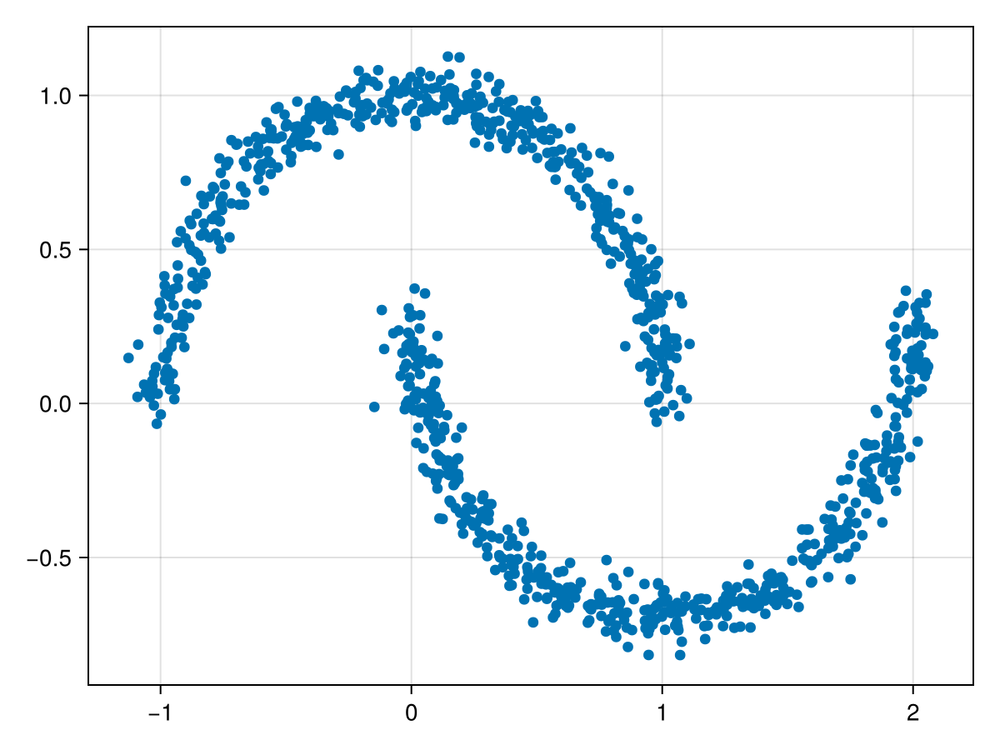

+++
date = "2050-01-01"
title = "Test post"
var"layout-post" = nothing
tags = ["julia"]
rss = "Test post"

# # Dependent variables
# website_description = replace(rss, "*" => "")
# rss_pubdate = 2050-01-01
+++


# Test

## Subheading
Below comes some text and math.

**Goal.**
Given a training dataset of samples from some target distribution $q$ over $\mathbb{R}^d$, out goal is to build a model capable of generating new samples from $q$.

**Approach.**
Flow Matching addresses this by building a probability path $(p_t)_{0 \leq t \leq 1}$ from a known source distribution $p_0 = p$ to the data target distribution $p_1 = q$, by learning a "velocity field" that describes the instantaneous velocities of samples. Later, this is used to convert the source distribution $p_0$ into the target distribution $p_1$ along the probability path $p_t$. Once trained, we generate samples by sampling from $p$ and then propagating the sample along the velocity field by solving the corresponding ODE. 

## Another subheading for a section with some code

```julia
# First some cde with a large output
[collect(1:10000), collect(1:10000)]
```

```
2-element Vector{Vector{Int64}}:
 [1, 2, 3, 4, 5, 6, 7, 8, 9, 10  …  9991, 9992, 9993, 9994, 9995, 9996, 9997, 9998, 9999, 10000]
 [1, 2, 3, 4, 5, 6, 7, 8, 9, 10  …  9991, 9992, 9993, 9994, 9995, 9996, 9997, 9998, 9999, 10000]
```


```julia
using MLJBase, CairoMakie

X, _ = make_moons(1024; noise=0.05)
X = collect.(MLJBase.Tables.rows(X))

scatter(
    [x[1] for x in X], [x[2] for x in X], 
)
```


